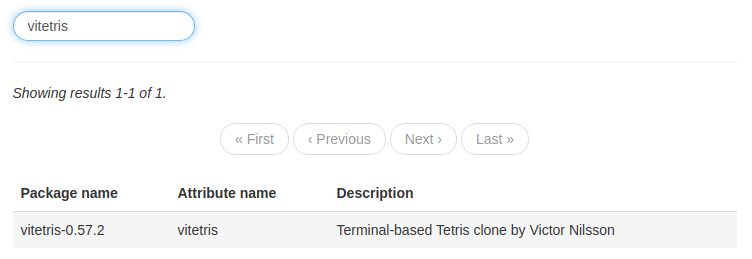

# Installing programs

There are many different ways of installing programs on NixOS. In this section, we will cover two methods of installing programs that use the `configuration.nix` file.

## Method 1: Installing programs using the `programs` attribute

_Certain_ programs can be installed by using the following structure in your `configuration.nix` file:

```nix
programs = {
	# Programs go here
};
```

Only a few programs can be installed this way - these programs can be found [here](https://nixos.org/nixos/options.html#programs.) by using the NixOS options search feature, or by using the nix repl:

```nix
nix repl '<nixpkgs/nixos>'
nix-repl> builtins.attrNames config.programs
```

> **Note**
>
> Using this method for installing programs is desirable if possible compared to method 2, as this normally sets the required environment variables for the program to function properly. In addition, various configuration options are available _(e.g. adding shell aliases to the fish shell)_
> 
> Of course, this is only an option if the specific program you want exists in the programs attribute.

### Example: Installing and setting up the `fish` shell

In this example, we enable the program `chromium`, as well as the `fish` command. We also add an alias to the `du` command called `dirsize` which can be used within the fish shell:
```nix
programs = {

	chromium.enable = true;

	fish = {
		enable = true;
		shellAliases = [
			dirsize = "du -sh"
		];
	};

};
```

## Method 2: Installing programs using the system packages

> **Unfree packages**
>
> Certain packages are known as `unfree`, which means that their license states that they cannot be redistributed (for example, Google Chrome). In order to install `unfree` packages, you need to add the following to your `configuration.nix` file:
> ```nix
> nixpkgs.config = { 
>     allowUnfree = true; 
> };
> ```

This method of installing programs is the primary method of installing programs in NixOS. It basically uses the entire Nixpkgs suite of packages and allows you to choose the packages you want. The general structure in your `configuration.nix` file will look something like this:

```nix
environment.systemPackages = with pkgs; [
	# Packages go here
];
```

Finding packages is a little bit more tricky compared to finding programs in method 1. The following strategies are as follows:

### Using the `nix search` command

Using `nix search` is the easiest way to find packages for your current version of NixOS. Simply type `nix search <packageName>` to search for a specific package

```
$ nix search google chrome
* nixpkgs.google-chrome (google-chrome)
  A freeware web browser developed by Google

* nixpkgs.google-chrome-beta (google-chrome-beta)
  A freeware web browser developed by Google

* nixpkgs.google-chrome-dev (google-chrome-dev)
  A freeware web browser developed by Google

* nixpkgs.python37Packages.PyChromecast (python3.7-PyChromecast)
  Library for Python 3.4+ to communicate with the Google Chromecast
```

To use a package from the `nix search` command, **you must include the package name after `nixpkgs`, not the name in brackets**. This is due to various package 'flavours' being packaged under a single package name.

For example:

```nix
environment.systemPackages = with pkgs; [
	google-chrome
	gnome3.gnome-mahjongg
];
```

### Using the online package search

Using the [NixOS package search](https://nixos.org/nixos/packages.html#) website, it's easy to find packages. The name required in the system packages from this website is the **Attribute name** field.



```nix
environment.systemPackages = with pkgs; [
	vitetris
];
```
