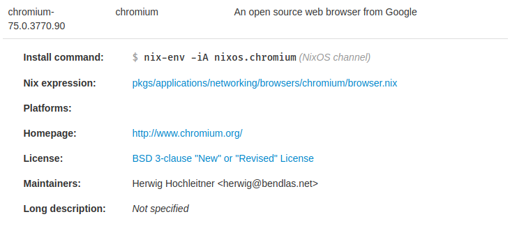

# Setting package options

The NixOS configuration file not only allows you to configure the system, but it also allows you to configure the process of building itself. This is done by changing the attributes of the `nixpkgs` option. This also allows you to edit the settings of other applications which are installed in your system packages.

## Enabling unfree software

As mentioned in the chapter on installing programs, unfree software (software that is not permitted to be redistributed) can be installed by using the following in your `configuration.nix` file:

```nix
nixpkgs.config = {
	allowUnfree = true;
};
```

## Setting package specific settings

Using the [NixOS package search website](https://nixos.org/nixos/packages.html#) that was described in the chapter on installing programs, we are able to search for packages that we want. When you click on the package, it provides information about the package. In particular, we want to look at the **Nix expression** for the package. This concept is better explained using an example:

### Example: Enabling flash on Chromium:

Firstly, we search for chromium using the NixOS package website. Clicking on the result provides us with a link to the Nix expression where this package is defined:



Following the link leads us to a file called `browser.nix`. Unfortunately, in order to find the list of potential settings, we need to use the main endpoint for packages, which is the `default.nix` file. This can be done by changing directories (shown at the top of the file on GitHub) to find the relevant `default.nix` file.

A snippet of the chromium `default.nix` file is shown below:

```nix
...

# package customization
, channel ? "stable"
, enableNaCl ? false
, gnomeSupport ? false, gnome ? null
, gnomeKeyringSupport ? false
, proprietaryCodecs ? true
, enablePepperFlash ? false
, enableWideVine ? false
, cupsSupport ? true
, pulseSupport ? config.pulseaudio or stdenv.isLinux
, commandLineArgs ? ""
}:

...
```

Any parameters followed with a `?` are basically optional, where the value after the `?` is their default value. In this example, we want to enable flash, so what we want to do is basically redefine the package named "chromium" with a copy of the package, except with the `enablePepperFlash` option set to true.

```nix
nixpkgs.config = {

	chromium = {
		enablePepperFlash = true;
	};

};
```

And it's that easy. This basically changes the package `chromium` which is used in `environment.systemPackages` to our new version of chromium that has pepper flash enabled (Pepper Flash is basically flash, but maintained by Google instead of Adobe). When the configuration is built, it will use the version of chromium that we have declared as opposed to the default version of chromium.
